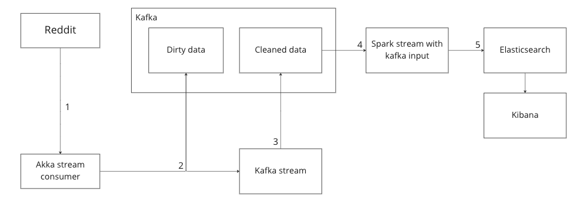

# Reddit dashboard project

Miro dashboard: https://miro.com/app/board/uXjVP-8Rzu8=/

## Outcome:
The outcome of this project will be a kibana dashboard of data pulled out from reddit.
See data shown section for more details.

The data can be live. It will be getting produced and cleaned then uploaded to elasticsearch which kibana will consume from

The underlying infrastructure will be a kubernetes cluster.

There will be some way to monitor the health of this cluster. Setup some sort of metric collector - prometheus?

There will be some way to check how many consumers are running and their throughput.

## Data shown

The data shown will be:
... todo fill out

## Data flow
The general flow will be something like this:

Where there will be multiple flows of raw vs cleaned vs aggregated data.

Doing it in multiple stages like this to work with different technologies.
And could allow lots of different formatted data going into raw as long as the cleaner knows how to clean it.

## Technology stack
* Scala language
* Akka streams
* Spark streaming
* Kafka
* Elasticsearch
* Kibana

## Abstract Stages of work
More details in individual stages documentation and in miro.
1) Akka stream consumer to get raw reddit post data and produce it to dirty data topic
    * Question: How and where should all the comments on the post get filled in? Should they at first wack?
    * I think this will just get data and push it without doing anything expect adding some metadata maybe.
2) Kafka stream to get dirty data and produce to cleaned data.
    * Reddit data that I am looking at seems to be in a pretty weird format. Organize it a bit better for part3.spark consumption
3) Spark stream consumption 
    * Spark process to consume from cleaned data kafka topic.
    * Perform aggregations, produce all the shaped data to elasticsearch
    * Question: Who is going to prep elasticsearch for data ingestion? Going to use strict index mapping
4) Setup elasticsearch queries to use in kibana. Make a dashboard and find out how to publically expose it.
    * Will need nginx/throttler to protect it from the mean internet

## More concrete stages of work:
1) Do #2 above first. Can mock dirty data fairly easily.
2) Then do #3
3) Then do #1
At this point everything should be working in docker
4) Setup deployment infrastructure   
